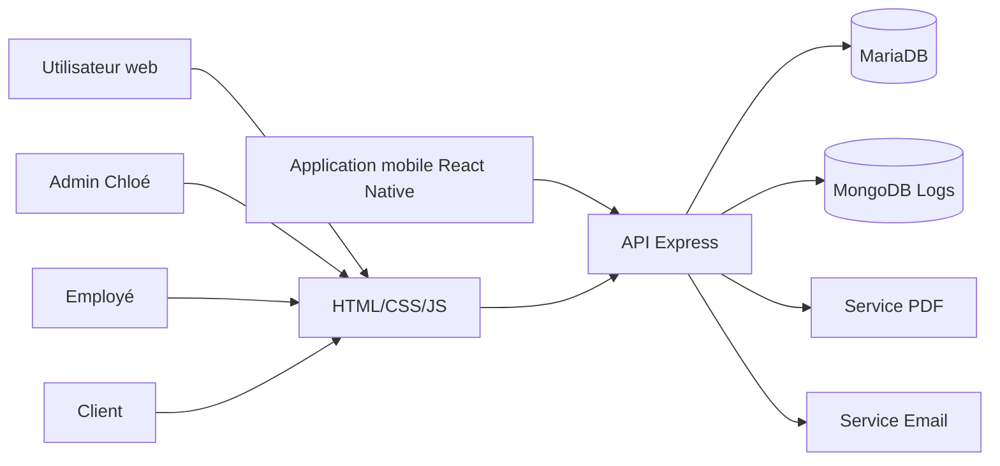

# Documentation technique - Innov'Events Manager

## 1. Objectif
Centraliser les informations clients, prospects, événements, devis, notes, tâches et avis afin d'éviter les fichiers Excel/Word dispersés. L'application devient la source unique de vérité.

## 2. Architecture logicielle


### Couches
- Présentation : pages HTML/CSS/JS et application mobile Expo.
- Métier : routes Express et services métier.
- Données relationnelles : MariaDB.
- Données non relationnelles : MongoDB pour les logs.
- Infrastructure : Docker Compose.

## 3. Sécurité
- Hash des mots de passe avec bcrypt.
- Authentification JWT.
- Contrôle des rôles : ADMIN, EMPLOYEE, CLIENT.
- Validation minimale côté serveur.
- Journalisation des actions sensibles.
- Les IP sont des données personnelles : elles sont journalisées uniquement pour la sécurité, avec une durée de conservation à définir et mentionnée dans la politique RGPD.

## 4. Base relationnelle
Tables principales : users, prospects, clients, events, quotes, quote_items, notes, tasks, reviews.

## 5. Base NoSQL
Collection MongoDB `logs` :
```json
{
  "timestamp": "ISODate",
  "type_action": "CREATION_CLIENT",
  "id_utilisateur": 1,
  "details": { "id": 12, "nom": "Durand" }
}
```

## 6. Docker
Le projet contient un conteneur backend, un conteneur MariaDB et un conteneur MongoDB.

## 7. Git
Branches : main et dev. Les développements partent de dev puis sont fusionnés dans main après tests.

## 8. Éco-conception
- Pages simples et légères.
- Peu de dépendances front.
- Images optimisées.
- Requêtes limitées avec pagination à prévoir.
- Mutualisation des services dans Docker.
