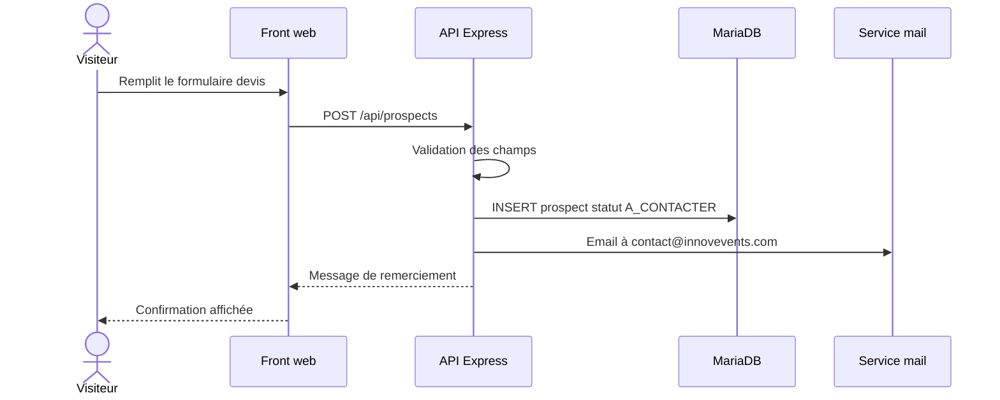

# Diagrammes

## Cas d'utilisation

```mermaid
flowchart TD
Visiteur --> Devis[Demander un devis]
Visiteur --> Contact[Contacter la société]
Visiteur --> Events[Consulter événements]
Client --> Espace[Consulter espace client]
Client --> Accepter[Accepter/refuser devis]
Client --> Avis[Déposer avis]
Employe --> Notes[Ajouter notes]
Employe --> Tasks[Gérer tâches assignées]
Employe --> Moderation[Valider/refuser avis]
Admin --> Prospects[Gérer prospects]
Admin --> Clients[Gérer clients]
Admin --> Evenements[Gérer événements]
Admin --> Quotes[Gérer devis]
Admin --> Users[Gérer comptes]
Admin --> Logs[Consulter journalisation]
```

## Séquence - demande de devis

```mermaid
sequenceDiagram
actor V as Visiteur
participant F as Front web
participant A as API Express
participant DB as MariaDB
participant M as Service mail
V->>F: Remplit le formulaire devis
F->>A: POST /api/prospects
A->>A: Validation des champs
A->>DB: INSERT prospect statut A_CONTACTER
A->>M: Email à contact@innovevents.com
A-->>F: Message de remerciement
F-->>V: Confirmation affichée
```
