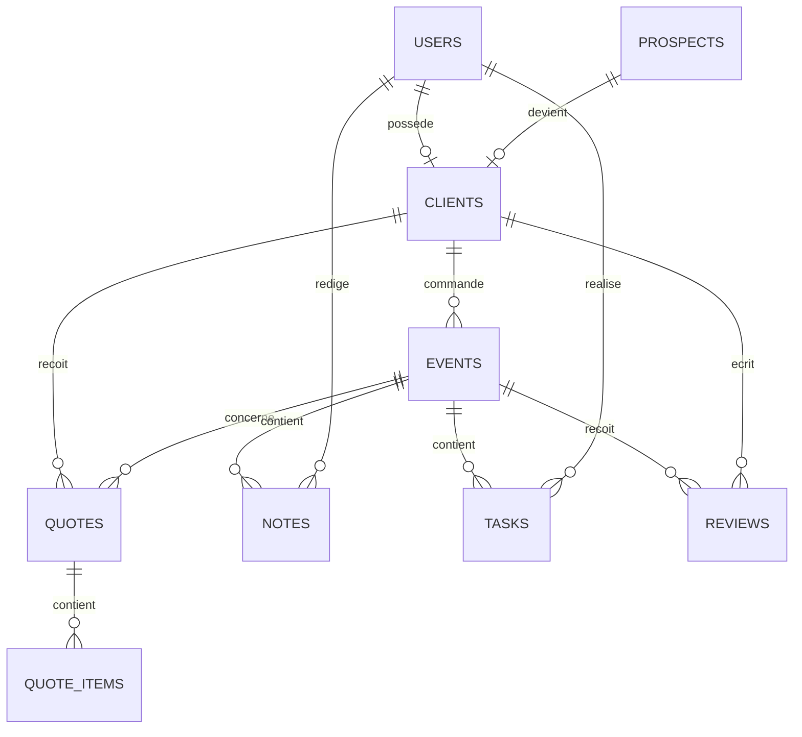

# MCD - Innov'Events

## Règles de gestion
- Un prospect peut être converti en client.
- Un client peut avoir plusieurs événements.
- Un événement peut avoir plusieurs devis.
- Un devis contient plusieurs prestations.
- Les logs sont stockés dans MongoDB.
